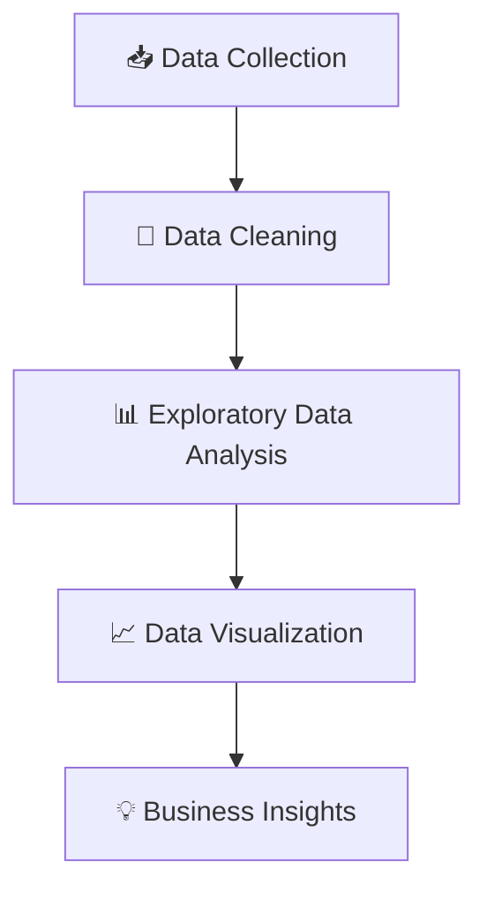

# 🛒 GoPuff Sales Analysis Project

<div align="center">


</div>

---

# 📌 Project Overview

This project focuses on analyzing **GoPuff sales data** using Python for uncovering valuable business insights and trends.

The analysis includes:

✅ Data Cleaning
✅ Exploratory Data Analysis (EDA)
✅ KPI Analysis
✅ Sales Performance Analysis
✅ Outlet Performance Analysis
✅ Item Category Analysis
✅ Business Visualization Dashboards

The objective of this project is to understand customer purchasing behavior, outlet performance, and sales trends to support data-driven decision-making.

---

# 🚀 Tech Stack

<div align="center">


</div>

---

# 📂 Dataset Features

| Column Name               | Description             |
| ------------------------- | ----------------------- |
| Item Fat Content          | Fat content category    |
| Item Type                 | Product category        |
| Sales                     | Total sales generated   |
| Outlet Size               | Outlet size category    |
| Outlet Location Type      | Location classification |
| Outlet Establishment Year | Outlet setup year       |
| Outlet Type               | Type of outlet          |
| Item Visibility           | Product visibility      |
| Item Weight               | Weight of item          |

---

# ⚙️ Project Workflow



---

# 🔍 Analysis Performed

## 🧹 Data Cleaning

✔️ Removed duplicate records
✔️ Handled missing values
✔️ Corrected inconsistent data
✔️ Standardized column formatting
✔️ Improved data quality for analysis

---

## 📊 KPI Analysis

The project includes important business KPIs such as:

* 💰 Total Sales
* 📦 Product Category Sales
* 🏪 Outlet-wise Sales
* 📍 Location-wise Performance
* 🍔 Fat Content Distribution
* 📈 Establishment Year Trends

---

# 📈 Visualizations Included

<div align="center">

| Visualization           | Description                       |
| ----------------------- | --------------------------------- |
| 🥧 Pie Charts           | Sales by Fat Content              |
| 📊 Bar Charts           | Sales by Item Type                |
| 📉 Line Charts          | Sales Trend by Establishment Year |
| 📌 Grouped Charts       | Outlet Performance Analysis       |
| 🔥 Correlation Analysis | Business Relationship Insights    |

</div>

---

# 📌 Major Insights

✨ Low-fat products contribute significantly to sales.
✨ Certain outlet locations generate higher revenue.
✨ Outlet establishment year impacts total sales performance.
✨ Item categories show strong variation in sales contribution.
✨ Medium and large outlets dominate overall business sales.

---

# 📷 Dashboard Preview

<div align="center">


</div>

---

# 🛠️ Libraries Used

```python
import pandas as pd
import numpy as np
import matplotlib.pyplot as plt
import seaborn as sns
```

---

# 🚀 How to Run the Project

## 1️⃣ Clone Repository

```bash
git clone https://github.com/your-username/your-repository-name.git
```

## 2️⃣ Open Project Folder

```bash
cd your-repository-name
```

## 3️⃣ Install Required Libraries

```bash
pip install pandas numpy matplotlib seaborn jupyter
```

## 4️⃣ Run Notebook

```bash
jupyter notebook
```

---

# 📁 Project Structure

```bash
📦 GoPuff-Sales-Analysis
 ┣ 📜 GoPuff Analysis Project.ipynb
 ┣ 📄 gopuff_data.csv
 ┣ 📄 README.md
 ┗ 📂 Charts
```

---

# 📊 Sample Business Questions Solved

✔️ Which item category generates the highest sales?
✔️ Which outlet type performs best?
✔️ How does fat content affect total sales?
✔️ Which outlet size contributes most revenue?
✔️ What trends exist in yearly outlet performance?

---

# 🌟 Future Improvements

🚀 Build interactive Power BI dashboard
🚀 Create Streamlit web application
🚀 Add predictive sales forecasting
🚀 Deploy project online
🚀 Integrate machine learning analytics

---

# 📊 GitHub Analytics

<div align="center">


</div>

---

# 🤝 Connect With Me

<div align="center">

<a href="https://www.linkedin.com/">

</a>

<a href="https://github.com/">

</a>

<a href="mailto:your-email@gmail.com">

</a>

</div>

---

<div align="center">

## ⭐ Star this repository if you found it useful ⭐


</div>
